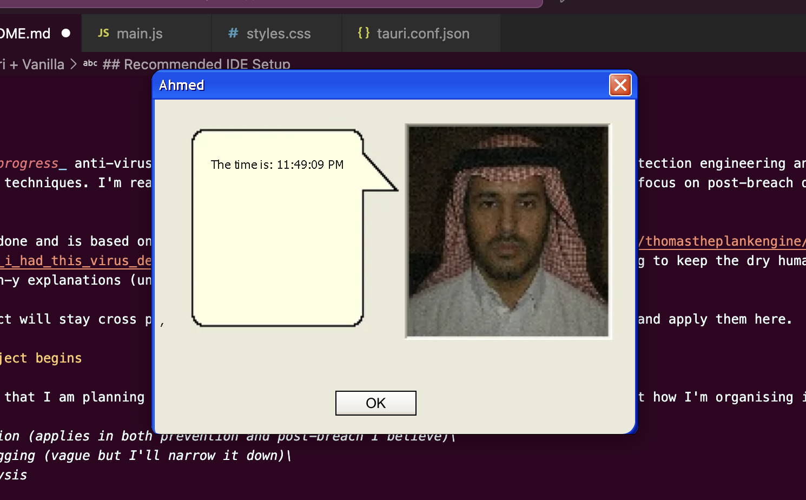

# Ask Ahmed

looks good bro

AskAhmed is _in progress_ anti-virus and (hopefully) EDR that I'm building as a way to practice detection engineering and also to learn evasion techniques. I'm really interested in realtime EDR features at the moment so I'll focus on post-breach detection for now.

The frontend is done and is based on [this dream by a random reddit user](https://www.reddit.com/r/thomastheplankengine/comments/1l57o80/i_dreamt_i_had_this_virus_detection_program_which/) that I thought was hilarious. I'm going to keep the dry human talk and minimize tech-y explanations (unless they want them).
 

Also, this project will stay cross platform. My goal is to learn both Windows and Mac OS internals and apply them here.

# And so the project begins

These are things that I am planning to study and then implement. Please be patient. I'll figure out how I'm organising it later.

> Entropy detection (applies in both prevention and post-breach I believe)\
> Anti-anti-debugging (vague but I'll narrow it down)\
> PE Header analysis

# Tauri + Vanilla

Made with the template :3

## Recommended IDE Setup

- [VS Code](https://code.visualstudio.com/) + [Tauri](https://marketplace.visualstudio.com/items?itemName=tauri-apps.tauri-vscode) + [rust-analyzer](https://marketplace.visualstudio.com/items?itemName=rust-lang.rust-analyzer)
